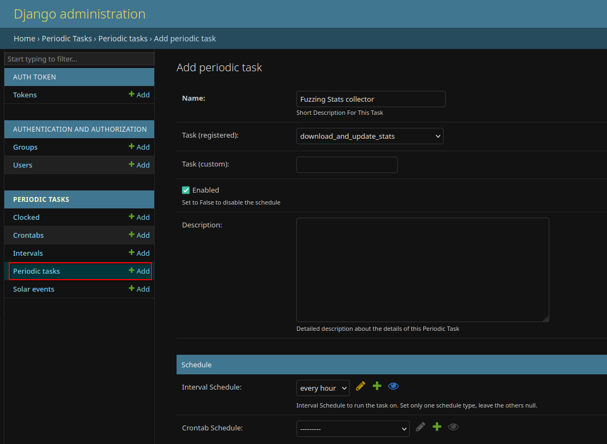

# Asynchronous Tasks Setup

This document provides instructions for setting up and managing asynchronous tasks in the PinguCrew backend.

---

## Overview

Asynchronous tasks are used to handle background operations such as data processing, analytics, and periodic updates. The system uses **Celery** as the task queue and **django-celery-beat** for periodic task scheduling.

---

## Prerequisites

Ensure the following are set up before configuring tasks:
1. **RabbitMQ**: Used as the message broker.
2. **TimescaleDB**: Used for storing analytics data.
3. **Minio**: Used for storing coverage files.

---

## Example Task: Fuzzing Stats Collector

The "Fuzzing Stats collector" task processes coverage files dropped into Minio buckets and inserts the data into the TimescaleDB analytics database.

### Steps to Configure

1. **Add the Task to Periodic Tasks**

   Use the Django admin interface to schedule the task:

   - Navigate to **Periodic Tasks** > **Add Periodic Task**.
   - Fill in the details:
     - **Name**: Fuzzing Stats collector
     - **Task (registered)**: `download_and_update_stats`
     - **Interval Schedule**: Set to `every hour` or as needed.
   - Save the task.

   

2. **Verify the Task**

   Start the Celery worker and beat scheduler using the provided `celery_runner.sh` script:

   ```bash
   bash celery_runner.sh
   ```

   This script will:
   - Start the Celery worker to process tasks.
   - Start the Celery beat scheduler to manage periodic tasks.

---

## Monitoring Tasks

You can monitor task execution using the RabbitMQ management interface or in the Django Admin panel. 
---

## Notes

- Ensure that the Celery worker and beat scheduler are running for tasks to execute.
- Use secure credentials for RabbitMQ and TimescaleDB in production environments.
- Periodically review and optimize task schedules to avoid overloading the system.