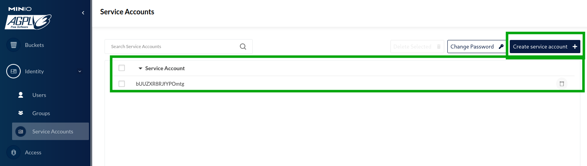

# Bucket Storage

The system supports two storage providers: **Minio** and **File System**. This document explains how to configure and use both providers.

## Minio Storage Provider

Minio is an object storage service compatible with the Amazon S3 API. It is used as the primary storage provider in the system.

### Configuration

The Minio configuration is located in `config/minio/config.yaml`. Update the following fields as needed:

```yaml
env:
  MINIO_HOST: localhost
  MINIO_API_PORT: 9000
  MINIO_WEB_PORT: 9001
  MINIO_ACCESS_KEY: <your-access-key>
  MINIO_SECRET_KEY: <your-secret-key>
  MINIO_ROOT_USER: <your-root-user>
  MINIO_ROOT_PASSWORD: <your-root-password>
```

### Accessing the Minio Dashboard

You can access the [Minio dashboard](http://127.0.0.1:9001) to manage buckets and objects. Use the credentials specified in the configuration file.


To create access tokens for bots or the Django backend, navigate to the Service Accounts page and generate a new token:



## File System Storage Provider

The File System storage provider uses the local file system to store objects. It is useful for development or environments where Minio is not available.

Configuration
The File System storage provider does not require additional configuration. By default, it uses a directory on the local file system to store objects.

Directory Structure
The storage directory is organized as follows:

```bash
<filesystem_dir>/
  ├── <bucket_name>/
  │   ├── objects/
  │   └── metadata/
```

objects/: Contains the actual files.
metadata/: Contains metadata for the stored objects.

## Switching Between Providers

The storage provider can be switched by updating the system configuration. Ensure that the appropriate provider is initialized in the codebase.

* MinioProvider: Use this for Minio-based storage.
* FileSystemProvider: Use this for local file system storage.

## Notes

- For production environments, it is recommended to use Minio with secure credentials.
- Ensure proper permissions are set for the storage directories when using the File System provider.
